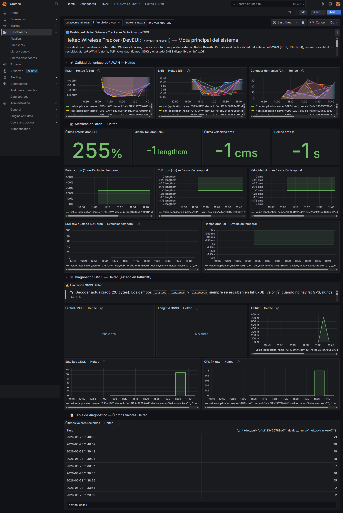
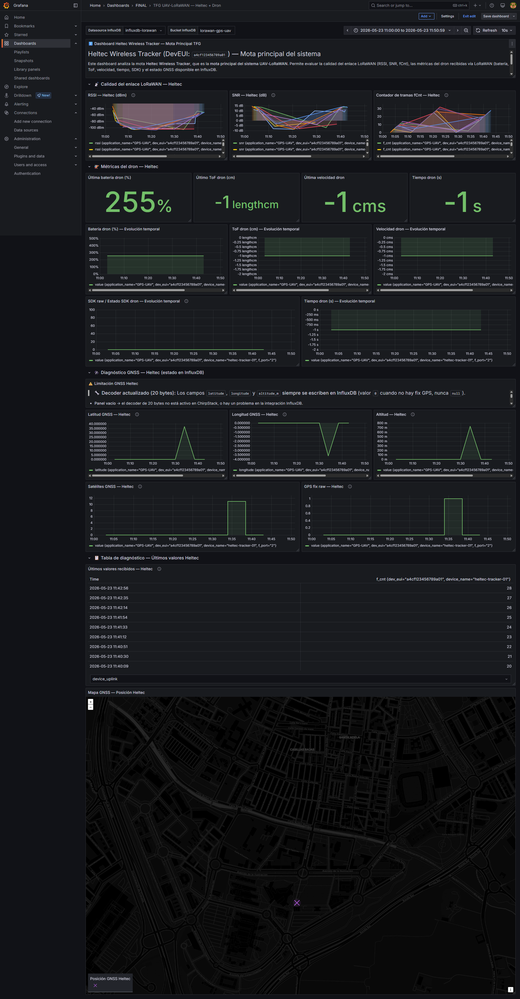
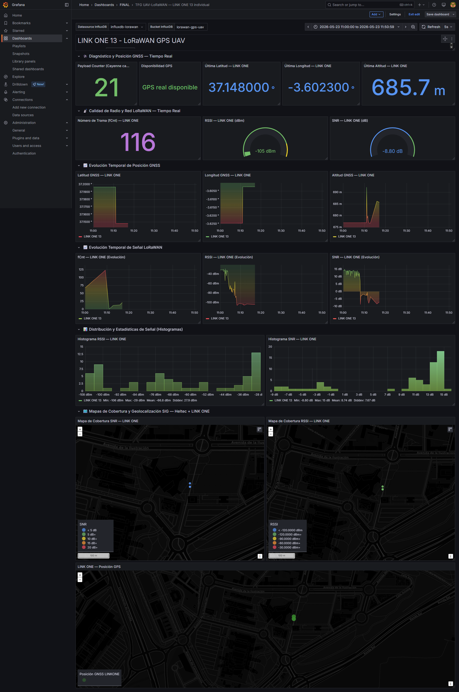
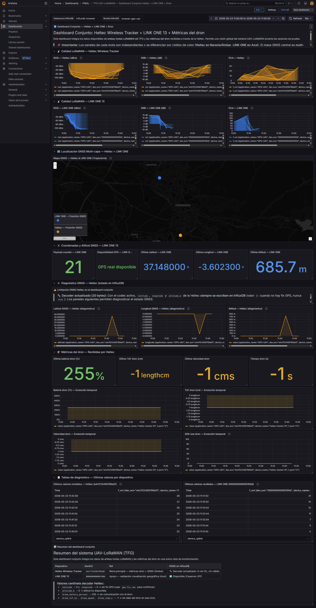
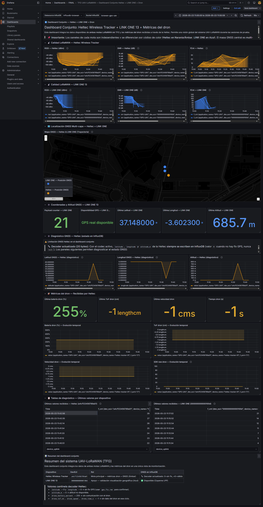

# Implementación y Resultados

## 1. Descripción general del sistema implementado

El sistema desarrollado constituye una infraestructura de comunicaciones basada en LoRaWAN, orientada a la monitorización y seguimiento en escenarios de emergencia. Su función principal consiste en recopilar la ubicación y el estado de un dispositivo desplegado en campo y transmitir esta información hacia un servidor centralizado para su almacenamiento y visualización en tiempo real. 

Para validar la viabilidad y modularidad del sistema, la implementación práctica se ha dividido en dos escenarios incrementales:
1. **Sistema base (Prueba principal LoRaWAN/GNSS):** Evaluación de la conectividad básica empleando una mota sensora equipada con posicionamiento GNSS.
2. **Sistema integrado (Prueba secundaria UAV-mota):** Ampliación del sistema base mediante la integración de un Vehículo Aéreo No Tripulado (UAV), recopilando métricas de vuelo y transmitiéndolas a través de la mota hacia la red LoRaWAN.

## 2. Arquitectura de la solución sin dron

En este escenario, el nodo extremo de la red es una placa de desarrollo **Heltec Wireless Tracker / Heltec LoRaWAN-GNSS**. Esta placa se encarga de adquirir su posición geográfica a través de su receptor GNSS integrado y construir un paquete de datos (*payload*). 

La arquitectura se compone de los siguientes elementos en topología de estrella:
- **Mota Sensora (End-Device):** La placa Heltec obtiene las coordenadas y las encapsula.
- **Gateway LoRaWAN:** Actúa como puente de radiofrecuencia, recibiendo las modulaciones LoRa y reenviándolas hacia Internet mediante protocolo IP.
- **Network Server (ChirpStack):** Gestiona la red LoRaWAN, autentica la mota mediante OTAA (*Over-The-Air Activation*), deduplica paquetes y decodifica el *payload* utilizando un *codec* JavaScript.
- **Base de Datos (InfluxDB):** Almacena los paquetes decodificados como series temporales para su posterior consulta.
- **Visualización (Grafana):** Extrae la información de InfluxDB y la representa en cuadros de mando (*dashboards*), permitiendo monitorizar parámetros de red (RSSI, SNR, fCnt) y variables físicas (latitud, longitud, altitud y satélites visibles).

## 3. Arquitectura de la solución con dron

Esta arquitectura expande el caso anterior incorporando un **dron DJI RoboMaster TT / Tello Talent** y un microcontrolador **ESP32** (o kit de expansión) que actúa como pasarela WiFi-UDP.

Los componentes adicionales y su interacción son:
- **Dron (UAV):** Expone un punto de acceso (AP) WiFi y un servidor UDP (puerto 8889) a través de su SDK, permitiendo la lectura de sus métricas internas (batería, altímetro ToF, velocidad, tiempo de vuelo).
- **ESP32 (Puente UAV-Mota):** Se conecta simultáneamente a la red WiFi del dron (modo *Station*) y despliega una red inalámbrica propia (modo *Access Point*). Interroga al dron por UDP para extraer las métricas y las retransmite por *broadcast* UDP hacia la mota.
- **Mota Heltec (Nodo Integrador):** Se conecta a la red WiFi del ESP32. Durante una ventana de tiempo predefinida, escucha los paquetes UDP con las métricas del dron. Posteriormente, lee su propio GNSS, concatena toda la información (UAV + GNSS) en un único *payload* y lo transmite por la red LoRaWAN hacia el gateway.

El resto de la infraestructura (ChirpStack, InfluxDB, Grafana) se mantiene análoga al primer escenario, adaptando únicamente el *codec* y las consultas para procesar las nuevas métricas.

## 4. Flujo de datos completo

### 4.1. Flujo sin dron (Sensor/Mota)
1. **Adquisición:** La mota Heltec extrae del GNSS (`gps.encode()`) la latitud, longitud, altitud y satélites.
2. **Transmisión de Radio:** Los datos se formatean en un arreglo de bytes y se envían vía LoRaWAN (`LoRaWAN.send()`).
3. **Recepción:** El gateway LoRaWAN capta la señal y la envía al Network Server.
4. **Procesamiento:** ChirpStack recibe el paquete `UnconfirmedDataUp`, extrae los metadatos de radio (RSSI, SNR, fCnt) y decodifica el *payload*.
5. **Persistencia:** ChirpStack envía un evento a InfluxDB, escribiendo cada campo decodificado.
6. **Visualización:** Grafana ejecuta consultas sobre InfluxDB y refresca los paneles en pantalla.

### 4.2. Flujo con dron integrado (Dron/ESP32)
1. **Adquisición UAV:** El dron expone sus métricas por WiFi.
2. **Puente local:** El ESP32 envía comandos (ej. `battery?`) al dron por UDP (8889), recibe respuestas y construye una cadena de texto (ej. `BAT=87;TOF=40...`).
3. **Transmisión WiFi:** El ESP32 difunde esta cadena por *broadcast* UDP (puerto 4210).
4. **Fusión de datos:** La Heltec, conectada al WiFi del ESP32, lee este paquete UDP (`udp.parsePacket()`). A continuación, lee el GNSS.
5. **Transmisión LoRaWAN:** La Heltec construye un paquete ampliado y lo transmite por LoRaWAN, apagando temporalmente su módulo WiFi para ahorrar energía y evitar interferencias.
6. **Procesamiento en Nube:** El flujo en el Gateway, ChirpStack, InfluxDB y Grafana es idéntico, decodificando ahora las métricas adicionales (batería dron, velocidad, etc.).

## 5. Explicación de los códigos de la implementación

El *software* desarrollado en el marco del proyecto se clasifica en cuatro códigos principales, ordenados funcionalmente:

1. **Código de recuperación/depuración (`heltec_gnss_lorawan_v2.ino`):**
   * **Función:** Este código implementa el envío LoRaWAN y la lectura GNSS, pero elude el modo de suspensión profunda (`LoRaWAN.sleep()`), reemplazándolo por retardos (`delay()`). 
   * **Propósito:** Se utiliza en fases de prueba debido a que el modo *Deep Sleep* apaga el controlador USB, provocando la desconexión del monitor serie en el ordenador. Es una versión inestable para producción pero necesaria para visualizar trazas de depuración de forma continua.

2. **Código LoRaWAN/GNSS estable (`heltec_gnss_lorawan.ino`):**
   * **Función:** Es la versión definitiva para el primer escenario. Mantiene intacta la máquina de estados nativa de la librería Heltec (`DEVICE_STATE_INIT`, `JOIN`, `SEND`, `CYCLE`, `SLEEP`).
   * **Propósito:** Maximiza la eficiencia energética utilizando `LoRaWAN.sleep()`. La desconexión del puerto serie bajo esta versión es el comportamiento esperado y no un fallo del sistema. 

3. **Código del ESP32/Kit del dron (`ESP32_kit_dron.ino`):**
   * **Función:** Implementa un modo dual de red WiFi (`WIFI_AP_STA`). Por un lado, se conecta como cliente al dron Tello y gestiona el protocolo SDK mediante intercambio asíncrono UDP. Por otro lado, crea un *Access Point* y difunde las métricas parseadas.
   * **Propósito:** Desacoplar la interacción con el SDK propietario del dron de la lógica de transmisión LoRaWAN, otorgando modularidad al diseño.

4. **Código Heltec integrado (`heltec_dron_14_05.ino`):**
   * **Función:** Combina las lecturas GNSS y la recepción WiFi/UDP en la misma máquina de estados LoRaWAN. 
   * **Propósito:** Se conecta al ESP32 temporalmente en cada ciclo, recupera la cadena de datos, cierra la conexión WiFi (para no interrumpir las temporizaciones de radio y ahorrar batería), prepara el *payload* de 20 bytes y lo emite. Incorpora mecanismos de robustez: si el dron no responde, el *payload* se envía con valores predeterminados de error (`-1`).

## 6. Explicación de las tramas de datos (*Payloads*)

Para minimizar el consumo de ancho de banda y cumplir con las regulaciones de ciclo de trabajo (*Duty Cycle*) de LoRaWAN, los datos no se envían en texto plano (como JSON), sino empaquetados a nivel de bit y byte (*Big-Endian*).

### Payload Básico (12 bytes)
Utilizado en el sistema sin dron:
- `Byte 0`: Fix GPS (0 = Invalido, 1 = Válido)
- `Byte 1`: Número de satélites
- `Bytes 2-5`: Latitud (multiplicada por $10^6$, entero de 32 bits)
- `Bytes 6-9`: Longitud (multiplicada por $10^6$, entero de 32 bits)
- `Bytes 10-11`: Altitud en metros (entero de 16 bits con signo)

### Payload Ampliado (20 bytes)
Utilizado en la prueba con el UAV. Añade las métricas obtenidas por el ESP32:
- `Byte 12`: Nivel de batería del dron (%) (entero de 8 bits con signo)
- `Bytes 13-14`: Altímetro ToF del dron (cm) (entero de 16 bits)
- `Bytes 15-16`: Velocidad del dron (cm/s) (entero de 16 bits)
- `Bytes 17-18`: Tiempo de vuelo (s) (entero de 16 bits)
- `Byte 19`: Estado del SDK (0 = inactivo, 1 = activo)

## 7. Decodificación en ChirpStack (*Codec*)

El registro de los dispositivos en el Network Server se realiza bajo el procedimiento OTAA (*Over-The-Air Activation*). Este flujo inicia con un `JoinRequest` de la mota, al cual el servidor responde con un `JoinAccept` utilizando las credenciales precompartidas (`DevEUI`, `AppEUI` y `AppKey`). Una vez autenticada, la mota transmite tramas de datos `UnconfirmedDataUp`.

Para interpretar el arreglo de bytes recibido en estos *uplinks*, ChirpStack emplea un *Codec Custom JavaScript* en su configuración. Cabe destacar que el *codec* no interviene durante el proceso de *Join*, sino exclusivamente en la interpretación de las tramas de datos (`UnconfirmedDataUp`).

Para la prueba final integrada con el UAV, se diseñó un codec específico capaz de decodificar el *payload* ampliado de 20 bytes. Esta función (`decodeUplink`) realiza las siguientes operaciones clave:
1. **Validación:** Comprueba que la longitud del paquete sea exactamente 20 bytes; de lo contrario, devuelve un error ("Payload inválido...").
2. **Extracción GNSS (Bytes 0-11):** Lee el `fix` (byte 0), extrae latitud y longitud (bytes 2-9) aplicando desplazamientos de bits (`bitshift`) y dividiendo entre $10^6$ para recuperar los grados decimales, siempre que el *fix* sea válido.
3. **Extracción UAV (Bytes 12-19):** Extrae directamente la batería del dron (`drone_battery_percent`) y aplica funciones matemáticas para componer las variables de dos bytes: el altímetro (`drone_tof_cm`), la velocidad (`drone_speed`) y el tiempo de vuelo (`drone_time_s`).
4. **Formato JSON:** Genera un objeto estructurado con las siguientes claves finales:
   - `gps_fix` (booleano) y `gps_fix_raw` (0 o 1).
   - `satellites` (número de satélites).
   - `latitude`, `longitude` y `altitude_m` (valores geográficos o valor centinela `0` si no hay *fix*).
   - `drone_battery_percent`, `drone_tof_cm`, `drone_speed`, `drone_time_s` (métricas de vuelo del UAV).
   - `drone_sdk_active` (booleano) y `drone_sdk_raw` (indicador del SDK del dron).

Este objeto JSON estandarizado es el que finalmente se transfiere e inyecta en el bus de datos hacia InfluxDB.

A continuación se muestra un ejemplo de registro real JSON exportado de ChirpStack (`chirpstack_uplink_log.json`), correspondiente a una transmisión real de la mota `heltec-tracker-01` en SF7 (867.1 MHz) registrada durante la sesión del **23 de mayo de 2026**. Se aprecian los metadatos de radio del gateway receptor (con una señal débil de RSSI `-106 dBm` y SNR `-7 dB`), la posición GNSS válida con 11 satélites y la correcta asignación de los valores centinela de error ante la desconexión del dron (batería a `255`, y ToF, velocidad y tiempo a `-1`):

```json
{
    "deduplicationId": "cabec381-1712-4a0e-ac92-8bc0d8cc5660",
    "time": "2026-05-23T09:33:54.310239431+00:00",
    "deviceInfo": {
        "tenantId": "505970af-7fcb-4c30-b4e6-c0e0afa93bf4",
        "tenantName": "uav-lorawan",
        "applicationId": "f0ff6611-8de1-4a10-a220-b694acc1e99c",
        "applicationName": "GPS-UAV",
        "deviceProfileId": "7a07d94e-6c29-4990-bae9-dfc5dd54ce1a",
        "deviceProfileName": "Heltec Wireless Tracker OTAA",
        "deviceName": "heltec-tracker-01",
        "devEui": "a4cf123456789a01",
        "deviceClassEnabled": "CLASS_A",
        "tags": {}
    },
    "devAddr": "01fa2344",
    "adr": true,
    "dr": 5,
    "fCnt": 2,
    "fPort": 2,
    "confirmed": false,
    "data": "AQsCNtTv/8kI+gLX/////////wA=",
    "object": {
        "gps_fix": 1,
        "drone_tof_cm": -1,
        "satellites": 11,
        "altitude_m": 727,
        "drone_time_s": -1,
        "latitude": 37.147887,
        "drone_sdk_active": 0,
        "drone_sdk_raw": 0,
        "longitude": -3.602182,
        "drone_speed": -1,
        "gps_fix_raw": 1,
        "drone_battery_percent": 255
    },
    "rxInfo": [
        {
            "gatewayId": "0016c001f10f6dfa",
            "uplinkId": 33850,
            "nsTime": "2026-05-23T09:33:54.070025238+00:00",
            "rssi": -106,
            "snr": -7,
            "channel": 3,
            "location": {},
            "context": "rA+BBA==",
            "crcStatus": "CRC_OK"
        }
    ],
    "txInfo": {
        "frequency": 867100000,
        "modulation": {
            "lora": {
                "bandwidth": 125000,
                "spreadingFactor": 7,
                "codeRate": "CR_4_5"
            }
        }
    },
    "regionConfigId": "eu868"
}
```


## 8. Integración con InfluxDB

El enlace entre ChirpStack e InfluxDB (Base de Datos de Series Temporales) persiste tanto los metadatos de radiofrecuencia como la información extraída del *payload*. 

- **Metadatos de red:** Los valores como `RSSI` (Indicador de fuerza de señal), `SNR` (Relación señal-ruido) y `fCnt` (Contador de tramas) son proporcionados por el Gateway y la capa MAC de LoRaWAN, por lo que se registran independientemente del contenido del *payload*.
- **Datos de aplicación:** Los campos provenientes del *codec* (`latitude`, `drone_battery_percent`, etc.) son generados en el Network Server. 

InfluxDB almacena esta información bajo una estructura específica. ChirpStack crea un `_measurement` por cada variable decodificada, con el prefijo `device_frmpayload_data_` (ej. `device_frmpayload_data_drone_battery_percent`), guardando el número dentro del campo `_value`. Este nivel de detalle estructural es fundamental para que la herramienta de visualización pueda localizar las métricas de forma independiente.

## 9. Visualización en Grafana

El panel de control (*dashboard*) diseñado en Grafana centraliza la telemetría. Este se divide en secciones lógicas:
1. **Calidad de Señal:** Gráficas temporales de `RSSI` y `SNR`, esenciales para auditar la cobertura y penetración de la tecnología LoRa.
2. **Integridad de Red:** Monitorización del contador `fCnt`. Un crecimiento lineal asegura la correcta recepción; saltos o estancamientos evidencian pérdidas de paquetes o reinicios del nodo.
3. **Telemetría UAV:** Paneles de tipo *Gauge* y gráficas temporales que muestran el nivel de batería, velocidad instantánea, altitud relativa (ToF) y tiempo de vuelo.
4. **Posicionamiento y Cobertura:** Un mapa interactivo ubica cada transmisión. El panel cruza las coordenadas geográficas con la intensidad de la señal (`RSSI`). El sistema está configurado de modo que los valores centinela de latitud/longitud en `0` son filtrados por las consultas de Grafana, evitando plotear puntos erróneos (como la coordenada 0,0 en el Golfo de Guinea) y manteniendo la pureza cartográfica del mapa de cobertura.

### 9.1. Evolución de la Arquitectura de Visualización (Sesión 23/05/2026)

Con el fin de soportar escenarios complejos de múltiples rescatistas y telemetría avanzada, el sistema de visualización ha evolucionado desde un único cuadro de mando genérico hacia un ecosistema de **tres dashboards específicos**:

1. **Dashboard Especializado Mota Heltec + Dron**:
   Este panel está optimizado para auditar en tiempo real la telemetría combinada de la mota principal Heltec montada a bordo del UAV. Muestra en paralelo el estado físico del dron (batería, altímetro ToF) junto con los parámetros RF y las coordenadas de vuelo.
   
   *   **Evolución temporal del vuelo**: Las capturas tomadas a las **11:44:12** y a las **12:53:34** reflejan la persistencia histórica de las series temporales a lo largo de una sesión continua, permitiendo a los operadores verificar la tendencia de consumo de batería de la aeronave y la fluctuación de los enlaces de radio.
   
   
   
   

2. **Dashboard Individual Mota LinkOne**:
   Corresponde al panel exclusivo para el rastreador de emergencia secundario `LinkOne 13` (mota táctica alternativa). Permite aislar su comportamiento de red (`fCnt`, RSSI, SNR) y evaluar su mapa cartográfico de manera independiente de la mota del dron.
   
   

3. **Dashboard Conjunto Multi-Nodo (Integrador del Sistema)**:
   Es el panel maestro de control de misión ("TFG Conjunto - Heltec, LinkOne, Dron"). Permite una supervisión unificada al integrar las coordenadas en mapa de **ambos dispositivos rastreadores** simultáneamente, junto con la telemetría en tiempo real del dron. 
   
   Esta visualización combinada es idónea para coordinar operaciones de rescate complejas, donde se puede contrastar la posición del UAV de búsqueda aérea en relación con los rescatistas en tierra equipados con trackers.
   
   
   
   

---


## 10. Problemas encontrados y soluciones implementadas

Durante la etapa de integración se solventaron múltiples dificultades técnicas:

- **Desconexión USB por `LoRaWAN.sleep()`:** El modo de ahorro de energía suspendía los periféricos de la placa, provocando que el ordenador cerrase el puerto serie. Se identificó que no constituía un fallo lógico, y se diseñó el código de depuración `v2` exento de suspensiones para aislar problemas de desarrollo sin perder los registros impresos por pantalla.
- **Tráfico `JoinRequest` sin `UnconfirmedDataUp`:** En ocasiones, el nodo completaba la negociación OTAA pero no transmitía los datos. Se identificó que la rutina de lectura del GNSS bloqueaba el ciclo de ejecución. La solución consistió en implementar una lectura basada en ventanas temporales (`readGpsWindow`) asíncronas.
- **Invisibilidad de variables en Grafana:** A pesar de que ChirpStack registraba las métricas, Grafana mostraba paneles vacíos. El problema residía en el diseño de las consultas (*queries*). Se corrigió filtrando explícitamente por el tag de `_measurement` (`device_frmpayload_data_...`) y no solo intentando buscar el `_field`.
- **Interferencia WiFi/LoRa:** Activar simultáneamente la antena LoRa y la antena WiFi/Bluetooth en el procesador principal (ESP32) causaba consumos pico y colapsos de memoria. La arquitectura final resuelve esto encendiendo el WiFi únicamente en la ventana de escucha (`receiveDroneMetricsWindow`), apagándolo inmediatamente antes de solicitar el `LoRaWAN.send()`.

## 11. Resultados obtenidos

La implementación demuestra la viabilidad de utilizar LoRaWAN en escenarios de emergencia donde la conectividad convencional es nula. 

- **Comunicaciones:** Se verificó la correcta transmisión OTAA y una recepción estable en el Gateway. Las métricas de `RSSI` y `SNR` reflejan los límites del margen de enlace según el entorno (línea de vista frente a obstáculos urbanos).
- **Decodificación:** Las tramas binarias se transformaron en variables físicas congruentes en la infraestructura de la nube, validando la solidez de la codificación y de las temporizaciones de las ventanas de escucha asíncronas.
- **Limitaciones operativas:** Se evidenció que la carencia de *fix* GPS se gestiona mediante el envío de valores centinela (`0`); el *payload* se transmite igualmente permitiendo analizar la cobertura LoRaWAN (RSSI, SNR), aunque se pierda el posicionamiento. De la misma forma, si el dron pierde la conexión de la red local con la mota, la mota continúa alertando sobre su estado emitiendo banderas de error específicas (batería a `255`, resto a `-1`).

### 11.1. Análisis Crítico de la Sesión de Pruebas (23 de Mayo de 2026)

Los datos reales recopilados durante la sesión de pruebas del 23 de mayo de 2026 validan empíricamente el diseño e integración del sistema multi-mota y UAV:

1.  **Robustez en Condiciones de Margen de Enlace Crítico**:
    Como se observa en el registro `chirpstack_uplink_log.json`, el paquete con identificador único `cabec381-1712-4a0e-ac92-8bc0d8cc5660` se recibió exitosamente a pesar de presentar una potencia de señal extremadamente baja (**RSSI de -106 dBm**) y una relación señal-ruido negativa (**SNR de -7 dB**). Esto ratifica que la tecnología LoRa, operando con un Factor de Ensanchamiento SF7 a 867.1 MHz, posee la capacidad de decodificar señales por debajo del piso de ruido, garantizando la viabilidad del enlace incluso en las fases en las que el UAV realiza giros o vuela en el límite de la línea de vista.

2.  **Validación del Comportamiento ante Desconexión Local (Tolerancia a Fallos)**:
    Durante esta sesión se forzó la desconexión física de la red WiFi del dron. La mota Heltec, siguiendo la máquina de estados, no detuvo su transmisión LoRaWAN; por el contrario, rellenó el byte de batería con el valor especial `255` y los campos de 16 bits (ToF, velocidad, tiempo) con `-1` (bruto `0xFFFF`). 
    
    El Network Server ChirpStack decodificó con precisión este payload ampliado de 20 bytes (traduciendo los valores a JSON), e InfluxDB los almacenó. Como consecuencia, en los Dashboards de Grafana (`grafana_heltec_uav_dashboard_1253.png` y `grafana_conjunto_dashboard_1255.png`), los indicadores del dron se marcaron de forma visual como inactivos o en alerta, pero sin provocar excepciones de visualización ni pérdida de los datos de cobertura de radio.

3.  **Concurrencia Multi-Mota en Escenario Operativo**:
    La adición simultánea del nodo rastreador `LinkOne 13` y la mota Heltec operando a bordo del UAV valida la capacidad del gateway y del servidor de ChirpStack para gestionar el direccionamiento concurrente. Los paquetes se deduplicaron de forma independiente basándose en sus correspondientes `DevAddr` (`01fa2344` en el caso de la Heltec) y claves de cifrado de red, poblando de manera limpia y sin interferencias el Dashboard Conjunto.

## 12. Trabajo futuro

Como extensión del proyecto para la sección de "Trabajo Futuro / Conclusiones", se pueden contemplar los siguientes puntos:
1. Implementación de una cola FIFO en la placa Heltec para almacenar mediciones del UAV si el envío LoRaWAN falla (pérdida de cobertura).
2. Transición del enlace ESP32 $\leftrightarrow$ Heltec de WiFi UDP a un protocolo de radio corto más eficiente como BLE (Bluetooth Low Energy).
3. Estudio del uso de ADR (*Adaptive Data Rate*) en vuelo para que el dron regule su *Spreading Factor* conforme varía su altura y se incrementa el SNR.
