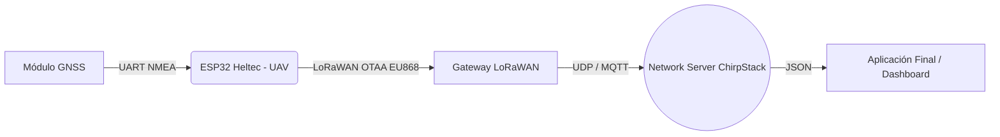

# Arquitectura de la Red UAV LoRaWAN

El Trabajo Fin de Grado propone una arquitectura enfocada en redes de emergencia, donde dispositivos finales puedan ser desplegados rápidamente usando drones (UAVs).

## Diagrama de la Red

## Componentes

1. **UAV / Dron**: Transporta la mota (nodo final) permitiéndole alcanzar posiciones con línea de visión directa (LoS) mejorada para las comunicaciones LoRa, y acceder a lugares complejos.
2. **Nodo Final (Heltec ESP32 + GNSS)**: Captura la latitud, longitud y altitud y envía estos datos compactados cada cierto tiempo.
3. **Gateway LoRaWAN**: Una antena y concentrador que capta la radiofrecuencia (banda EU868 en Europa) y la traduce a paquetes IP hacia el Network Server.
4. **ChirpStack (Network Server)**: Autentica los dispositivos, controla la seguridad de la red y decodifica el payload (usando nuestro `chirpstack_decoder.js`).
