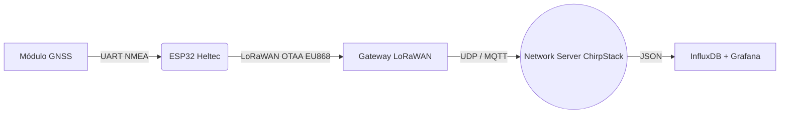
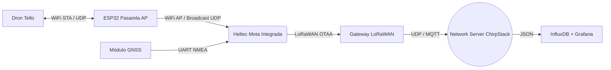

# Arquitectura de la Red UAV LoRaWAN

El Trabajo Fin de Grado propone una arquitectura enfocada en redes de emergencia, evaluada en dos escenarios incrementales: una prueba básica de posicionamiento y una prueba avanzada de integración con telemetría de vuelo.

## 1. Escenario Básico (Mota Sensora GNSS)

```mermaid
graph LR
    A[Módulo GNSS] -->|UART NMEA| B(ESP32 Heltec)
    B -->|LoRaWAN OTAA EU868| C[Gateway LoRaWAN]
    C -->|UDP / MQTT| D((Network Server ChirpStack))
    D -->|JSON| E[InfluxDB + Grafana]
```

## 2. Escenario Integrado (UAV + Pasarela WiFi)

```mermaid
graph LR
    UAV[Dron Tello] <-->|WiFi STA / UDP| ESP[ESP32 Pasarela AP]
    ESP -->|WiFi AP / Broadcast UDP| B(Heltec Mota Integrada)
    A[Módulo GNSS] -->|UART NMEA| B
    B -->|LoRaWAN OTAA| C[Gateway LoRaWAN]
    C -->|UDP / MQTT| D((Network Server ChirpStack))
    D -->|JSON| E[InfluxDB + Grafana]
```

## Componentes Principales

1. **UAV / Dron (Tello Talent)**: Vuela en la zona de emergencia. En el escenario integrado, expone su estado (batería, velocidad, ToF) mediante su SDK por WiFi.
2. **ESP32 Pasarela**: Actúa como puente intermedio montado en el dron. Se conecta al dron en modo *Station*, extrae las métricas por UDP y despliega simultáneamente un **Punto de Acceso (AP)** WiFi local (`UAV_METRICS_AP`).
3. **Nodo Final (Heltec ESP32 + GNSS)**: Captura la posición satelital. En el escenario integrado, enciende temporalmente su WiFi para conectarse como cliente al **AP del ESP32**, escuchar las métricas UDP del dron, unificar ambos datos y emitirlos por LoRa.
4. **Gateway LoRaWAN**: Concentrador de radiofrecuencia que enlaza el entorno físico con la infraestructura de red en la nube.
5. **ChirpStack + InfluxDB + Grafana**: El servidor de red valida la seguridad, decodifica el *payload* binario y lo transfiere a la base de datos temporal, para que Grafana pueda pintar el mapa de cobertura y las métricas.
