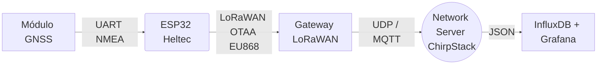
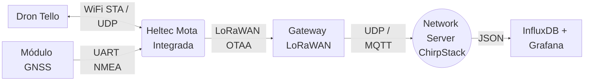

# Arquitectura de la Red UAV LoRaWAN

Este proyecto propone una arquitectura enfocada en redes de emergencia, evaluada en dos escenarios incrementales: una prueba básica de posicionamiento y una prueba avanzada de integración con telemetría de vuelo.

## 1. Escenario Básico (Mota Sensora GNSS)

```mermaid
%%{init: {"themeVariables": {"fontSize": "35px"}}}%%
graph LR
    A[Módulo GNSS] -->|UART NMEA| B(ESP32 Heltec)
    B -->|LoRaWAN OTAA EU868| C[Gateway LoRaWAN]
    C -->|UDP / MQTT| D((Network Server ChirpStack))
    D -->|JSON| E[InfluxDB + Grafana]
```

## 2. Escenario Integrado (UAV Directo)

```mermaid
%%{init: {"themeVariables": {"fontSize": "35px"}}}%%
graph LR
    UAV[Dron Tello] <-->|WiFi STA / UDP| B(Heltec Mota Integrada)
    A[Módulo GNSS] -->|UART NMEA| B
    B -->|LoRaWAN OTAA| C[Gateway LoRaWAN]
    C -->|UDP / MQTT| D((Network Server ChirpStack))
    D -->|JSON| E[InfluxDB + Grafana]
```

## Componentes Principales

1. **UAV / Dron (Tello Talent)**: Vuela en la zona de emergencia. En el escenario integrado, expone su estado (batería, velocidad, ToF) mediante su SDK por WiFi en el puerto UDP 8889.
2. **Nodo Final (Heltec ESP32 + GNSS)**: Captura la posición satelital y asume el rol de cliente directo de la red WiFi del dron. Enciende temporalmente su transceptor WiFi en cada ciclo para interrogar directamente al SDK del dron via UDP, asimilando sus métricas, consolidando ambos conjuntos de datos en un payload único de 20 bytes y transmitiéndolo por LoRaWAN.
3. **Gateway LoRaWAN**: Concentrador de radiofrecuencia que enlaza el entorno físico con la infraestructura de red en la nube.
4. **ChirpStack + InfluxDB + Grafana**: El servidor de red valida la seguridad, decodifica el *payload* binario y lo transfiere a la base de datos temporal, para que Grafana pueda pintar el mapa de cobertura y las métricas.
